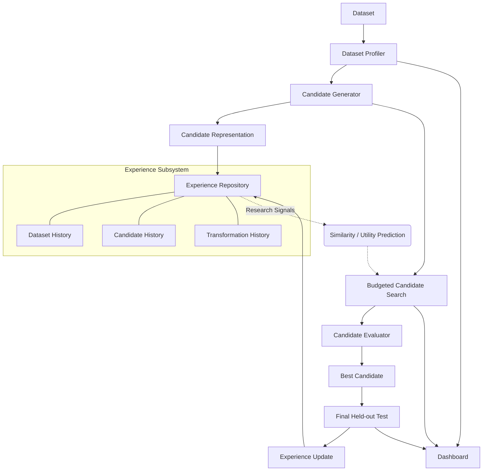

# ARCHITECTURE DIAGRAM

```mermaid
graph TD
    %% Core Production Pipeline
    A[Dataset] --> B[Dataset Profiler]
    B --> C[Candidate Generator]
    C --> D[Candidate Representation]
    
    %% Experience Subsystem
    subgraph Experience Subsystem
        E[Experience Repository]
        E1[Dataset History]
        E2[Candidate History]
        E3[Transformation History]
        E --- E1
        E --- E2
        E --- E3
    end
    D --> E
    
    %% Experimental Research Flow
    E -.->|Research Signals| F(Similarity / Utility Prediction)
    F -.-> G[Budgeted Candidate Search]
    
    %% Evaluation Flow
    C --> G
    G --> H[Candidate Evaluator]
    H --> I[Best Candidate]
    
    %% Final Validation & Update
    I --> J[Final Held-out Test]
    J --> K[Experience Update]
    K --> E
    
    %% Presentation Layer
    J --> L[Dashboard]
    B --> L
    G --> L
```

*Note: Solid lines denote the core production/demo execution path. Dashed lines denote the experimental research signal paths investigated during testing.*
